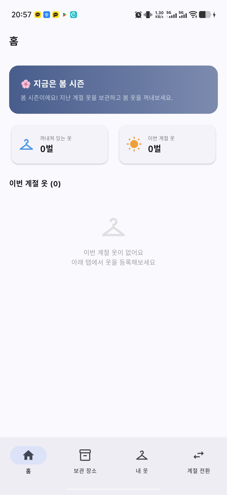
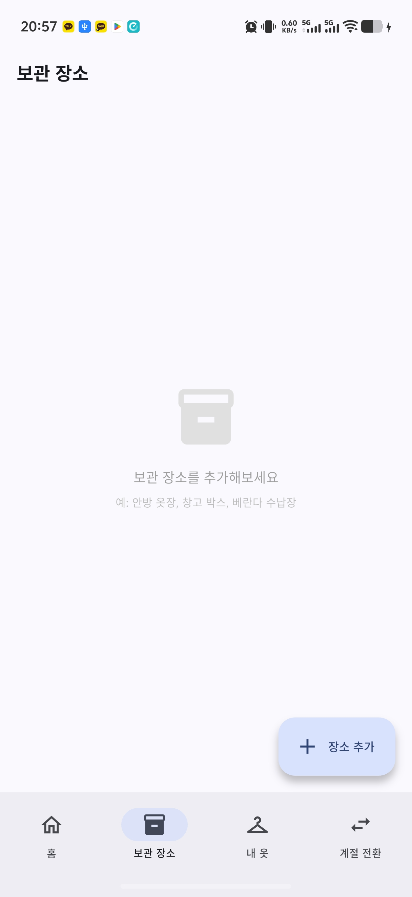
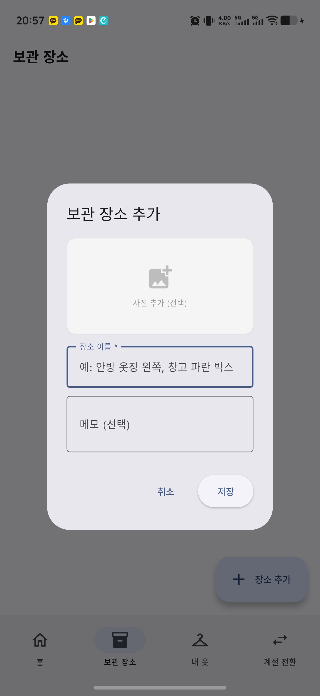
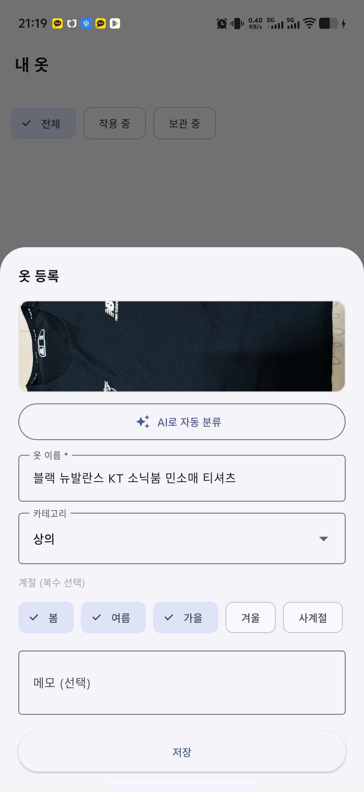
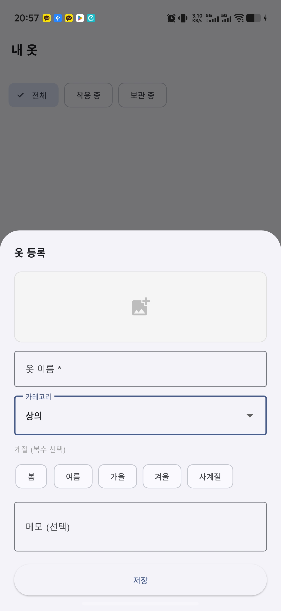
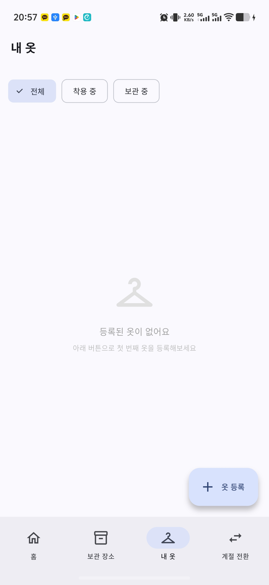
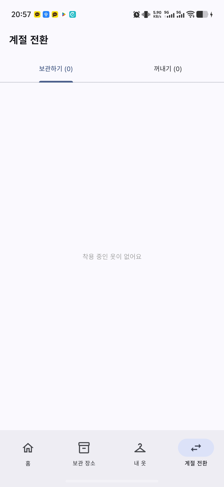
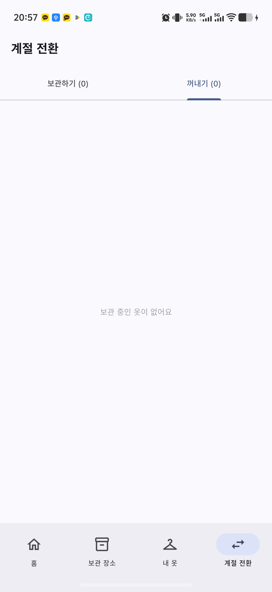

# 옷장지도 (ClosetMap)

> **내 옷이 어디 있는지, 지금 바로 찾아요**  
> 계절이 바뀔 때마다 "어디에 넣었지?" 를 해결하는 보관 위치 기반 옷 관리 앱

<br>

## 주요 기능

| 기능 | 설명 |
|---|---|
| 📦 보관 장소 관리 | 사진·이름·메모로 옷장/박스/수납장 등록 및 편집 |
| 🗺️ 옷장 구역 맵 | 옷장 사진 위에 서랍·행거·선반 구역을 드래그로 그리고, 구역별 보관 옷 확인 |
| 👕 옷 등록 | 카테고리·계절·색상·브랜드·구매가격으로 옷 정보 등록 및 편집 |
| ✨ AI 자동 분류 | 카메라/갤러리 사진 한 장으로 카테고리·계절·색상·이름 자동 인식 |
| 🎨 색상 태그 & 필터 | 14가지 색상 태그, 색상별 필터, 이미지 없을 때 색상 배경으로 시각화 |
| 💰 착용당 가격(CPW) | 구매가격 ÷ 착용횟수로 옷의 실제 가성비 자동 계산 |
| 👗 코디 기록 | 오늘 입은 옷을 여러 벌 선택해 코디로 저장, 착용 횟수 자동 반영 |
| 📤 코디 공유 카드 | 코디를 이미지 카드로 생성 — 옷 이미지 그리드·브랜드 칩·총 구매가·평균 CPW 포함, SNS 바로 공유 |
| ⚠️ 방치 옷 알림 | 6개월 이상 착용하지 않은 옷을 홈화면 배너 + 로컬 알림으로 안내 |
| 🔄 계절 전환 | 보관 전 체크리스트(세탁·상태·방충제) + 꺼낼 때 보관 기록 확인 |
| 🏠 홈 요약 | 현재 계절 배너, 착용 중 / 이번 계절 옷 수 요약, 최근 코디 목록 |

<br>

## 기술 스택

- **Flutter** (Dart) — 크로스플랫폼 모바일 앱
- **sqflite** — 로컬 DB (보관 장소 / 구역 / 옷 / 보관 기록 / 코디)
- **Firebase AI Logic** (Gemini 2.5 Flash) — 옷 이미지 AI 분류 (카테고리·계절·색상)
- **Firebase App Check** (Play Integrity) — API 무단 접근 방지
- **flutter_local_notifications** — 계절 전환 알림, 방치 옷 알림
- **shared_preferences** — 알림 중복 방지 날짜 저장
- **image_picker** — 카메라 / 갤러리 이미지 선택
- **dart:ui** — 옷장 사진 자연 해상도 기반 구역 좌표 계산
- **share_plus** — 코디 카드 이미지 외부 공유 (SNS, 카카오, 메시지 등)

<br>

## 스크린샷

<table>
  <tr>
    <td align="center"><br/>홈 — 계절 요약</td>
    <td align="center"><br/>보관 장소 목록</td>
    <td align="center"><br/>장소 추가</td>
    <td align="center"><br/>AI 자동 분류</td>
  </tr>
  <tr>
    <td align="center"><br/>옷 등록</td>
    <td align="center"><br/>내 옷 목록</td>
    <td align="center"><br/>계절 전환 — 보관하기</td>
    <td align="center"><br/>계절 전환 — 꺼내기</td>
  </tr>
</table>

<br>

## 빌드 방법

```bash
# 의존성 설치
flutter pub get

# 디버그 실행
flutter run

# 릴리스 AAB 빌드 (Play Store용)
flutter build appbundle --release
```

> **서명 설정:** `android/key.properties` 파일 필요 (Git에서 제외됨)  
> **Firebase 설정:** `android/app/google-services.json` 필요

<br>

## 프로젝트 구조

```
lib/
├── main.dart                    # 앱 진입점, Firebase 초기화
├── firebase_options.dart        # Firebase 프로젝트 설정
├── models/
│   ├── clothing.dart            # 옷 모델 (카테고리·계절·색상·브랜드·가격·착용기록)
│   ├── outfit.dart              # 코디 기록 모델
│   ├── storage_place.dart       # 보관 장소 모델
│   ├── storage_zone.dart        # 구역 모델 (사진 위 상대 좌표 0-1)
│   └── storage_log.dart         # 보관/꺼내기 로그 모델
├── services/
│   ├── database_service.dart    # sqflite DB CRUD (v4: 색상·브랜드·코디 테이블 포함)
│   ├── clothing_ai_service.dart # Gemini AI 옷 분류 (색상 추출 포함)
│   ├── season_service.dart      # 계절 판단 로직
│   └── notification_service.dart# 계절 전환 / 방치 옷 알림
├── widgets/
│   └── outfit_share_card.dart  # 코디 공유 카드 위젯 (이미지 그리드·브랜드·CPW)
└── screens/
    ├── home_tab.dart            # 홈 (계절 요약 + 코디 기록 + 방치 옷 배너 + 공유)
    ├── place_tab.dart           # 보관 장소 목록/편집
    ├── place_detail_screen.dart # 장소별 구역 맵 또는 보관 옷 목록
    ├── zone_editor_screen.dart  # 옷장 구역 드래그 편집기
    ├── clothing_tab.dart        # 옷 목록/편집/색상 필터/AI 분류
    └── season_tab.dart          # 계절 전환 (보관·꺼내기)
```

<br>

## 버전 이력

| 버전 | 내용 |
|---|---|
| v1.5.0 | 코디 기록 시트 상의·하의·신발·악세 탭 분리, 디매 양식 텍스트 자동 생성 및 클립보드 복사, 저장 직후 공유 유도 스낵바 |
| v1.4.2 | 코디 공유 카드 — 옷 이미지 그리드·브랜드 칩·총 구매가·평균 CPW가 담긴 카드 이미지 생성 후 SNS 바로 공유 |
| v1.4.1 | 앱 이름 표시 오류 수정, 시즌 기준 조정(봄 3~4월·여름 5~8월·가을 9~10월), 앱 아이콘 비율 수정 |
| v1.4.0 | 옷 검색(이름·브랜드·메모), 그리드/리스트 뷰 전환, 계절 전환 일괄 처리 |
| v1.3.0 | 색상 태그(AI 자동추출 포함)·색상 필터, 브랜드·구매가격·착용당 가격(CPW) 추적, 코디 기록(복수 옷 선택·wear_count 일괄 반영), 방치 옷 배너 및 로컬 알림 |
| v1.2.0 | 새 옷 등록 시 보관 중 상태 직접 지정, 상태 뱃지 탭으로 보관/꺼내기 즉시 전환, 사진 확대 보기, 계절 필터, 착용 횟수 자동 기록 |
| v1.1.0 | 옷장 구역 맵 — 사진 위 드래그로 서랍/행거/선반 구역 그리기, 구역 이름 지정, 구역별 보관 옷 조회·추가·제거 |
| v1.0.0 | 최초 출시 — 보관 장소/옷 관리, AI 자동 분류(Gemini), 계절 전환 체크리스트 |

<br>

## Google Play

[](https://play.google.com/store/apps/details?id=com.p2bble.closet_map)

> 최신 버전: v1.5.0 — 코디 기록 탭 분리 · 디매 양식 텍스트 복사 · 저장 후 공유 유도

<br>

## License

MIT
